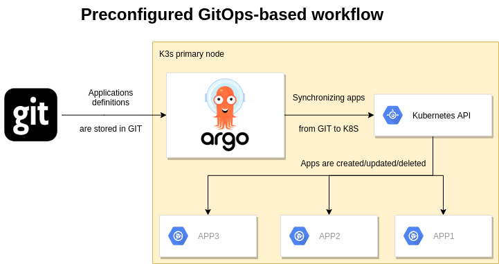
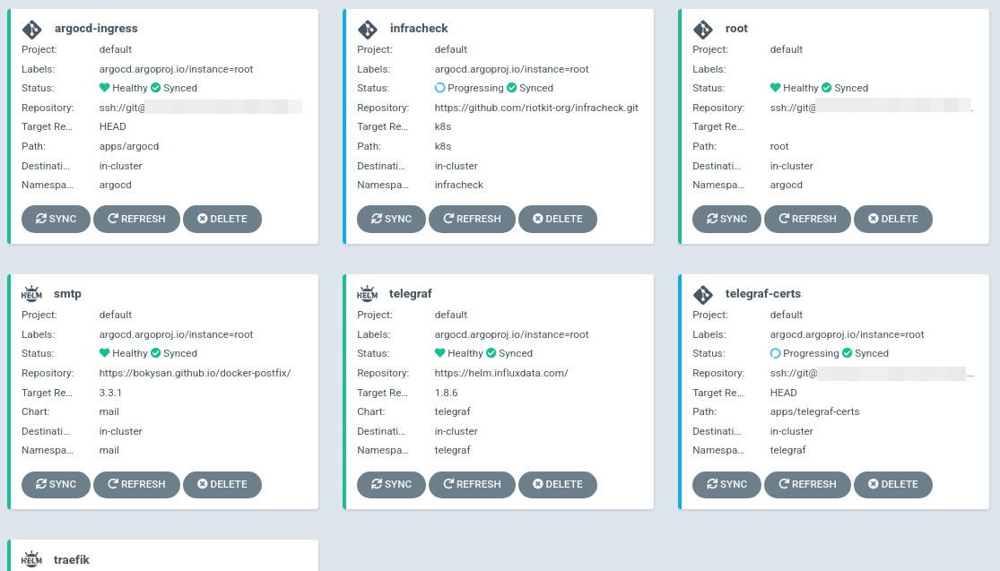
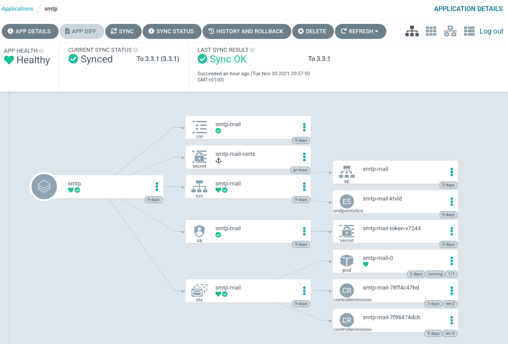

K3S Riotkit Cluster "Space Harbor"
==================================

DANGER: This project is highly in WORK IN PROGRESS state. Subscribe this repository for releases if you want to be notified. We will release soon.

Creates a lightweight, opinionated single-node or multi-node cluster managed fully by ArgoCD.
Requires write access to GIT repository.

GitOps flow
-----------







How it is installed
-------------------


Proposed VPN setup
------------------

This Ansible setup can handle multiple setups:
- One primary, no any compute nodes
- One primary + multiple compute nodes in same network without VPN
- One primary + multiple compute nodes exposed via WireGuard VPN remotely


Architecture
------------

**Provided by K3S:**
- CoreDNS + Flannel: Networking
- Embedded service load balancer (Rancher's Klipper Load Balancer)
- SQLite3 (can be replaced with etcd, there is a migration possibility)

**Of choice:**
- **Cluster management:** ArgoCD Core connected with a single "cluster-wide" GIT repository. Components synchronized on-click
- **Gateway:** Traefik + Let's Encrypt (lightweight comparing to NGINX + cert-manager)
- **Health checks:** Infracheck - health checks provided via HTTPS endpoint for external monitoring service (e.g. UptimeRobot), very lightweight comparing to Kuberhealthy
- **Metrics:** Telegraf, passing-through to centralized Telegraf instance over TLS authentication (own CA)
- **Secrets management:** https://github.com/bitnami-labs/sealed-secrets (lighttest solution possible, no maintenace except key backup)
- SMTP relay: https://artifacthub.io/packages/helm/docker-postfix/mail
- Backup: Backup Maker (part of [Backup Repository](https://github.com/riotkit-org/backup-repository))
- WireGuard VPN (if wanting to use VPN, kernel-level VPN, fastest and most secure, easy to setup and manage)

Most of the above components can be disabled in Ansible vars.
**Selection criterias:** lightweight, security, easy to setup

Security
--------

Kubernetes API is private, accessible only on `localhost:6443` and via VPN. ArgoCD is accessible on a public domain behind basic auth.

**Target security considerations**

1. Expose `Kubernetes Dashboard` and `ArgoCD` on separate HTTPS port
2. Use VPN to access `ArgoCD`, `Kubernetes API` and `Kubernetes Dashboard`

Installing 
----------

1. Create your own repository from this repository - use it as a template

2. Install roles from Ansible Galaxy

```bash
ansible-galaxy install -r requirements.yml
```

3. Prepare `playbook.yaml`, `inventory/hosts.yaml` - adjust variables to your needs

4. Put credentials - passwords and ssh keys in `inventory/group_vars/all.yaml`

5. Encrypt file `inventory/group_vars/all.yaml` using `ansible-vault encrypt inventory/group_vars/all.yaml`, so your passwords, ssh keys will stay secure while stored in GIT repository

6. Install inter-node VPN (skip if you don't connect multiple _compute nodes_ to remote _primary server_)

```bash
ansible-playbook ./playbook.yaml -k -i inventory/hosts.yaml --limit vpn
```

```bash
ansible-playbook ./playbook.yaml -k -i inventory/hosts.yaml --limit vpn-administrative
```

7. Install Kubernetes

8.1. Primary node at first

```bash
ansible-playbook ./playbook.yaml -k -i inventory/hosts.yaml -t k3s --limit k3s-primary
```

8.2. Next on compute nodes (if any)

```bash
ansible-playbook ./playbook.yaml -k -i inventory/hosts.yaml -t k3s --limit k3s-node
```


Upgrading
---------

Following upgrade commands will only execute 

### Compute node

```bash
ansible-playbook ./playbook.yaml -k -i inventory/hosts.cfg -t cluster --limit k3s-node -e force_k3s_upgrade=true
```

### Primary node

```bash
ansible-playbook ./playbook.yaml -k -i inventory/hosts.cfg -t k3s --limit k3s-primary -e force_k3s_upgrade=true
```

### Updating services - e.g Traefik, Infracheck

When Ansible values are changed you may want to update the services, so there is a simplified procedure to update internal services.

**Service tags:**
- git_argocd: Rewrite ArgoCD ingress configuration in GIT
- git_traefik: Rewrite Traefik configuration in GIT
- git_infracheck: Rewrite Infracheck configuration in GIT
- git_smtp: Rewrite SMTP configuration in GIT
- git_telegraf: Rewrite Telegraf configuration in GIT
- sealed_secrets: Reinstall Bitnami Sealed Secrets operator
- argocd: Reinstall ArgoCD, set admin password
- **git_all**: Rewrite all applications that are written in GIT repository, push

```bash
# Tags explanation:
#  git_argocd: Produce ArgoCD configuration in GIT repository (to be replaced with other app e.g. git_traefik). Requires "git" tag.
#  git: Push changes to GIT repository
#  sync: Synchronize pushed changes immediately in ArgoCD

ansible-playbook ./playbook.yaml -i inventory/hosts.yaml --limit k3s-primary -t git_argocd,git,sync
```

Management commands
-------------------

### Primary

- View logs: `journalctl --unit k3s --follow`
- Start: `systemctl start k3s`
- Stop: `systemctl stop k3s`
- List nodes: `k3s kubectl get nodes`
- Check node details: `kubectl describe node ...`

Using Sealed Secrets mechanism
------------------------------

After installing ArgoCD and synchronizing "sealed-secrets" application Ansible will store "sealed-secrets.cert.pem" file in `artifacts` local project directory.
Use `kubeseal` cli locally using this secret, or on the server using certificate at path `/etc/rancher/k3s/sealed-secrets.cert.pem`.

```bash
# on primary node
cat configmap.yaml | kubeseal --cert /etc/rancher/k3s/sealed-secrets.cert.pem

# locally
cat configmap.yaml | kubeseal --cert ./artifacts/sealed-secrets.cert.pem
```

Disconnecting nodes
-------------------

Procedure is to stop all pods, stop the agent, then delete the agent on primary.

```bash
# PART 1: On primary node
# stop or move all running pods on given machine
kubectl drain compute-xyz --ignore-daemonsets=true

# PART 2: On compute node
systemctl stop k3s-agent

# PART 3: On primary node - optionally, as this node will be anyway unschedulable 
# delete stopped agent from primary node list
kubectl delete node compute-xyz
```
